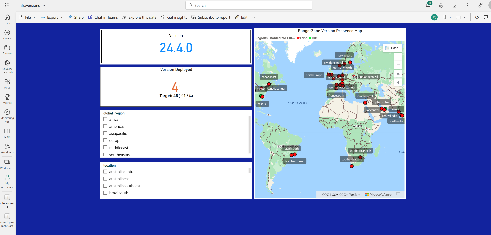

# azureRegionsAPI

>[!IMPORTANT]
>a simple RESTful API that returns Azure Regions and their geography (I will use this data to correlate application data as it relates to Azure Data Centers. You can visualize in Power Bi using Azure Maps, or if you have custom dashboards. Great, quick and easy API to retrieve Azure region geography and correlate to other data. Go and use in your Observability Pipelines (not as is of course.)
>

Installation: 
Prerequsites:
1. Python Installed
- [Python Installation]('https://www.python.org/downloads/)
2. Verify Installation
```bash
python --version
```
>[!NOTES]
>As you may or may not have heard 'it is always good to run your python applications in a virtual environment (that way it dont interfere with other process' on your system.)
>

3. Virtual Environment Install
Windows: 
```bash
python -m venv $anynameyouwant
```
Activate venv: 
```bash
.\$anynameyouwant\Scripts\activate
```
Linux/Mac: 
```bash
python -m venv $anynameyouwant
```
Activate venv:
```bash 
source $anynameyouwant/bin/activate
```
 or
```bash
  . $anynameyouwant/bin/activate
```

4. API Python Package Requirements Installation
- Navigate to same directory that you cloned this repo into and check for 'requirements.txt'
Type -
Windows:
```bash
Get-Items .
```
Linux/Mac
```bash
ls
```
>[!NOTE]
>Once you have verified the requirements.txt is present run:
```bash
pip install -r requirements.txt
```
Alternatively:
run:
```bash
pip install flask, flask-restful, azure-core, azure-identity, azure-identity, azure-mgmt-subscription
```

>[!NOTE]
> Once the installation is complete we can move on to working with our RESTful API

>[!WARNING]
> Before we can run the app locally, you set an environment environment variable for your azure subscription locally

Linux & Mac: 
```bash
export AZURE_SUBSCRIPTION_ID="your_subscription_id"
```
Windows: 
```bash
$AZURE_SUBSCRIPTION_ID = "your_subscription_id"
```


>Once your environment variable is set on your system (you can run the api.py file)


```bash
python .\api.py
```

Sample output from a view routes:

```bash
PS C:\apiguy> curl http://127.0.0.1:5000/list/azure/region/geography/

                                                                                                                                                                                    StatusCode        : 200                                                                                                                                                             
StatusDescription : OK                                                                                                                                                              
Content           : [                                                                                                                                                               
                        {
                            "name": "australiacentral",
                            "latitude": "-35.3075",
                            "longitude": "149.1244"
                        },
                        {
                            "name": "australiacentral2",
                            "latitude": "-35.3075",
                            "l...
RawContent        : HTTP/1.1 200 OK
                    Connection: close
                    Content-Length: 5479
                    Content-Type: application/json
                    Date: Tue, 14 May 2024 19:53:54 GMT
                    Server: Werkzeug/3.0.3 Python/3.12.1

                    [
                        {
                            "name": "australi...
Forms             : {}
Headers           : {[Connection, close], [Content-Length, 5479], [Content-Type, application/json], [Date, Tue, 14 May 2024 19:53:54 GMT]...}
Images            : {}
InputFields       : {}
Links             : {}
ParsedHtml        : mshtml.HTMLDocumentClass
RawContentLength  : 5479
```
```bash
PS C:\apiguy> curl http://127.0.0.1:5000/get/azure/region/geography/eastus2


StatusCode        : 200
StatusDescription : OK
Content           : [
                        {
                            "name": "eastus2",
                            "latitude": "36.6681",
                            "longitude": "-78.3889"
                        }
                    ]

RawContent        : HTTP/1.1 200 OK
                    Connection: close
                    Content-Length: 106
                    Content-Type: application/json
                    Date: Tue, 14 May 2024 19:55:02 GMT
                    Server: Werkzeug/3.0.3 Python/3.12.1

                    [
                        {
                            "name": "eastus2",...
Forms             : {}
Headers           : {[Connection, close], [Content-Length, 106], [Content-Type, application/json], [Date, Tue, 14 May 2024 19:55:02 GMT]...}
Images            : {}
InputFields       : {}
Links             : {}
ParsedHtml        : mshtml.HTMLDocumentClass
RawContentLength  : 106
```

Use Case:
Power Bi using Azure Maps

> I used the data in from the GET request to visualize Azure Region data in  powerbi to simulate version presence per Azure Region by importing postgres queries, etc...
>


